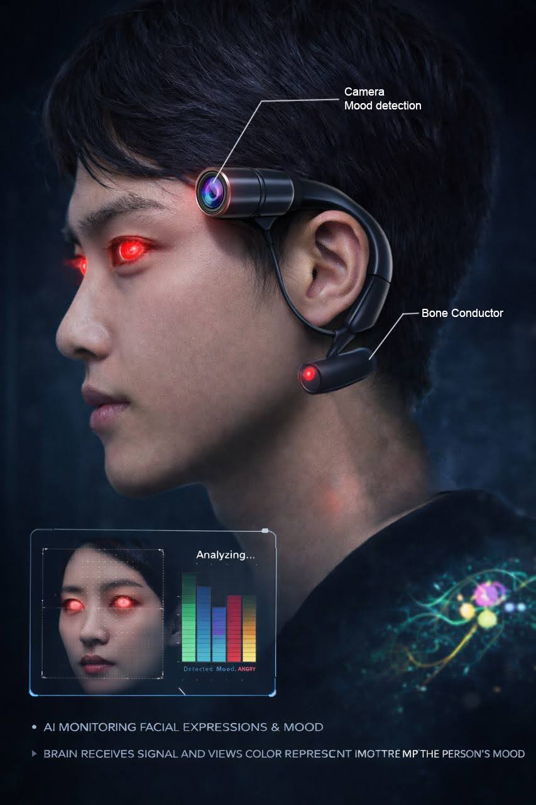

# Extended Intelligences II

## Reflections

I frown and wince when I hear the term AI these days. One of the most important aspects of the Master's has been unlearning the prescribed uses of consumer AI and exploring the potential uses of Creative AI. This course was an extension of that unlearning. By combining ai agents to real world environments through the bridge of sensors and microcontrollers, I was able to expand my thinking on what AI could be. When we were introduced to agents debating with each other, I wondered what it would be like to connect non human agents such as water data, weather data, temperature data and allow them to form agents to then debate with each other; a true environmental assembly of sorts.

## Project idea: Emotion detector through facial expressions

We initially wanted to use a camera to detect facial expressions and convert them into visible colour markers; like a mood ring of sorts. However, we faced a challenge as we couldn't connect the camera to the agentic system. We thus adapted the project to detect emotions from text that looked like teenage diary entries. By evloving the system, i realised we bypassed some ethiocal concerns that the camera based system might have had. By moving the input to text, we activated the position of the user to input their feelings instead of exploiting some one else's feelings to understand it. In a way i felt that it shifted the perspective of power in the system. 

 

### Ethics is key

I think that using AI to explore our own vulnerabilities is vastly different from using it to expose others'. Consent to using these systems is key when it comes to equalizing this power. Asking ourselves questions lie "who is this affecting?", "whom are we including and excluding?" and extrapolating all the problems that such a interventions with technology could bring us should be part of the discussion when designing anything with AI. And similarly, I found ourselves asking each other these questions when we were doing the assignment, which I feel was the success of this course. 