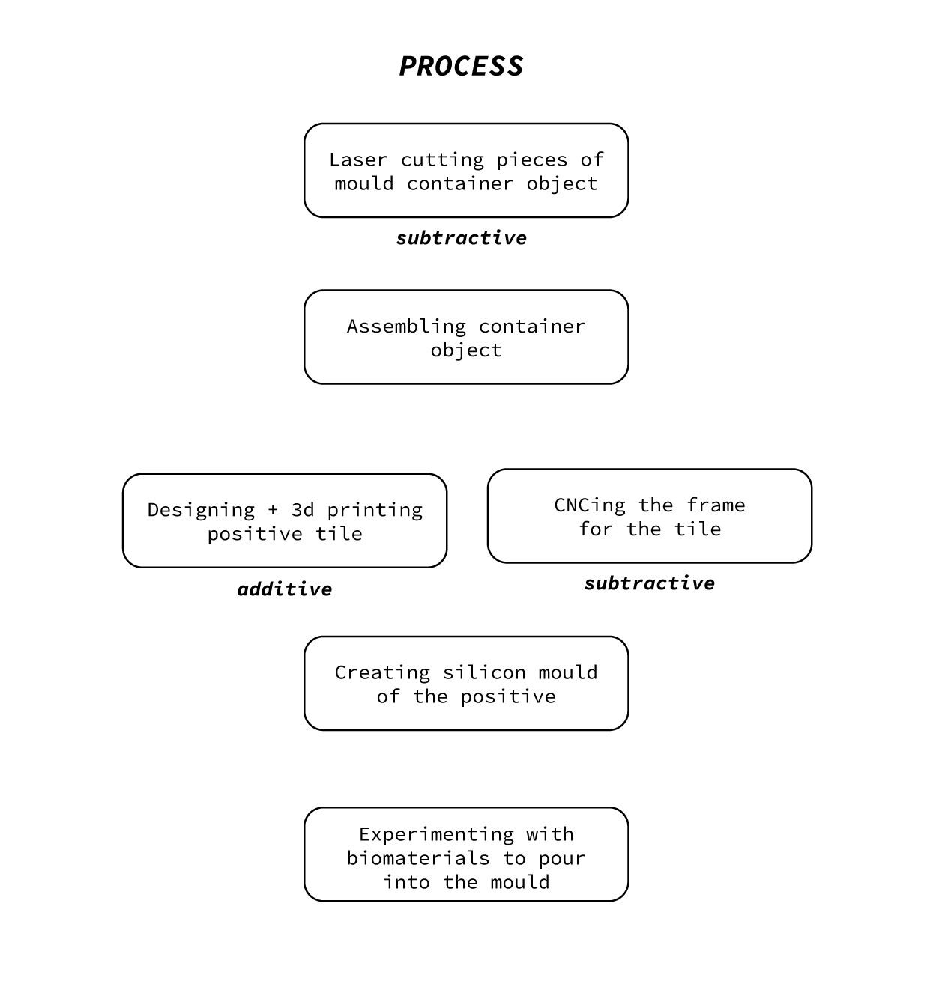
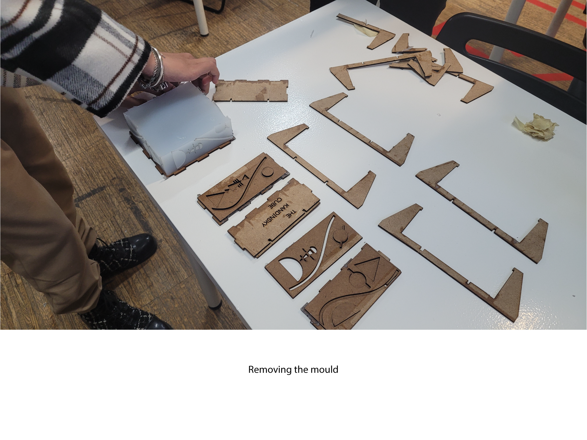
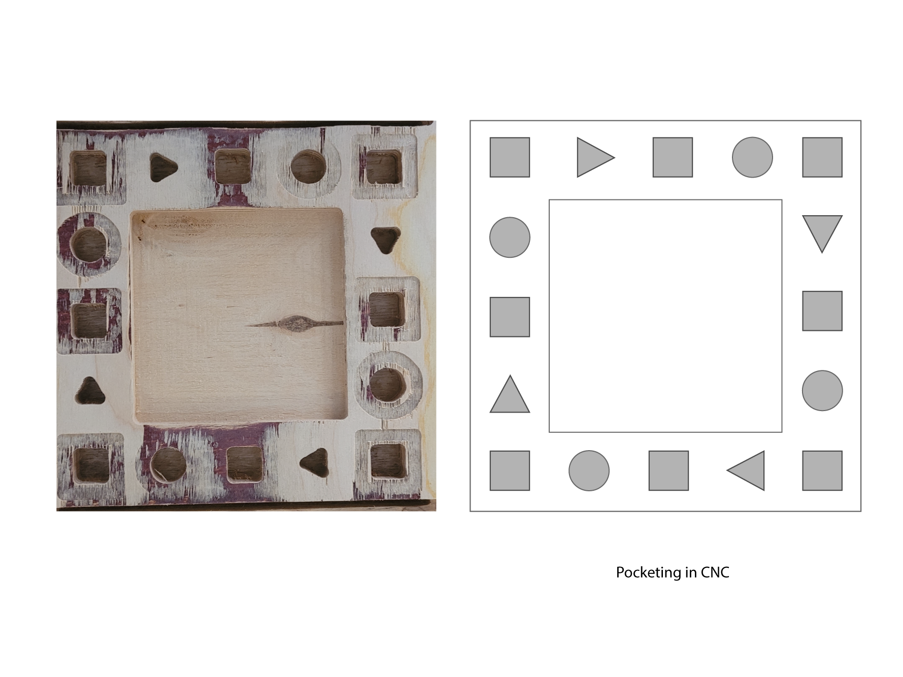

# Fundamentals of Digital fabrication

## Reflections

The fundamentals course was a quick run through different digital fabrications technique like laser cutting, 3d printing, cnc milling, electronics with arduino. We also experimentaed with manual fabrication techniques like biomaterials and moulds. The shift between the digital and the physical was a good exercise for our brains to bring our ideas into their material realities. I learnt that something could make perfect sense as an idea but when it comes to prototyping is when limitations tend to rise. It is important to keep iterating with a clear vision to bring out the best possible outcome. 

In the course we played with shapes and forms. Some shapes were easier to cut with certain machines while some hard. For example the CNC was very good with organic shapes while laser cutting was good with sharo edges. Throughout, we had to be careful of the tolerances of each machine and material and account for our designs accordingly. 

I loved that the course allowed us to play with different materials and experiment with designing them through our ideas. 

## The Kandinsky Cube

For the primary mould design we took inspiration from the paintings of Wassily Kandinsky. We made sharp triangles and curved circles to chash with one another to create a geometry of symphony. We carried over the concept to each of the digital fabrication techniques and learnt on the way. 

## Learnings

**Laser cutting** as a proceswas familiar since they were 2d patterns. Learning the settings to print was essential. Safety precautions like turning on the air flow, the exhaust pipe for gases and keeping the material intact to the laser cutting surface were the key learning.

During the **3d print** process we had to generate and design a 3d model on rhino. Ensuring that the model had no intersecting surfaces was a huge challenge. Having a lot of small cubes in a geometry there were many intersecting lines and dead surfaces that we had to clean up. The magic word was Boolean Union between the surfaces as we were building.

The **cnc milling** was more challenging to operate than design. We mistakenly pocketed the inside of the shapes than the outside. Thus the sharp corners of the triangle and aquare were not achieved.

Experimenting with silicon moulds and biomaterials were enjoyable as we cooked some interesting recipes. Stirring well and keeping in mind the process time was key in both. 

Team: Aishwarya and Swarna