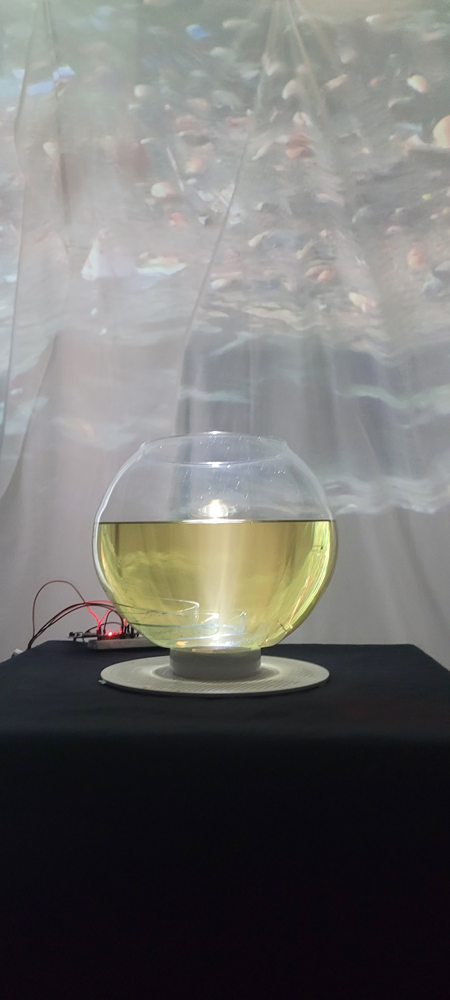
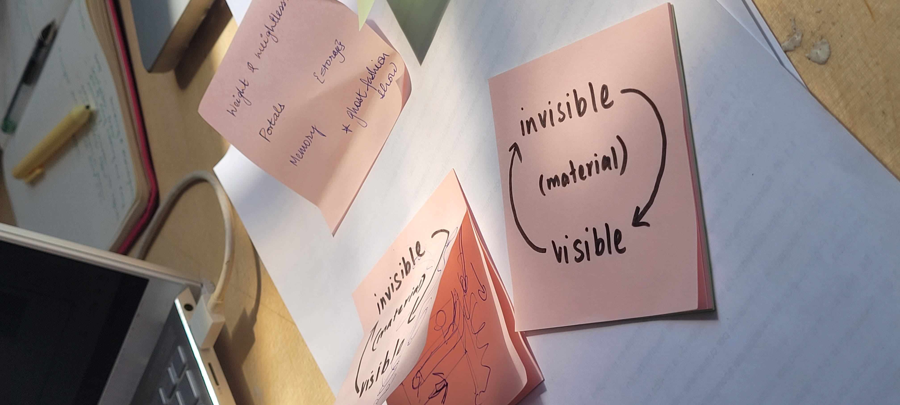

# Cognitive orgies 3

*What if you could confess your sins to a unnerving trash podium and gain redemption for your darkest consumption sins? By turning guilt into gumption you can start a new life again, maybe , maybe not? come, step inside the Chamber of Ecological Confession, so your fate maybe revealed.*

**[Chamber of Ecological Confession](https://www.hackster.io/549115/chamber-of-ecological-confession-0c2d35)**

## Initial brainstorming

Initially, we wanted to make something disappear and reappear again. Inspired by magic tricks and how to make the visible invisible and visible again proved to be a greater challenge than we thought it to be. We brainstormed concepts that include motors, mirror and liquids like oil and water. Finally, we landed upon the idea of refraction through oil and glass as it was the most cost effective and simplest way to explain our concept. It was also interesting because it added a dimension of materiality to the performace that technology and electronics couldn't have achieved which was one of our goals. n

## Technical challenges

Programming the proximity sensor was more challenging than we thought it to be. It was a bit tricky to get it to a state of complete on and off as it flickered a lot in the distance of change. We fixed it by adding a threshold. Then, making it seem like the podium was really talking to you, we prerecorded conversations and programmed the sentences in such a way that it would play the next dialogue once the sensor was deactivated and activated again. We choreographed it in such a way that the person would move away from the podium to return again.

For the audio, we used Processing to play the audio files. For the LED, arduino was used. Switching between the two softwares made the serial port get stuck and was harder to make changes.

LEDs were fried, wires were disconnected, oil was spilt, but nevertheless we pulled off the performance. 

## Physical Experimentation and Performance fails

The new aspect of this Cognitive Orgies was the brief of performance. Using technology to choreograph a user experience was very finnicky and not like an easy programming method like on or off with a button. Taking into consideration all human interaction and all the things that could go wrong was an essential part of the learning experience. 

1. While the oil experiment worked when we tested, in the final act it failed because we didn't test with the exact petri dish that we used. So the aha moment was missed. 

2. The proximity sensor glitched at times and we had to manipulate audio manually. 

If I were to do it again, I would add an element of compulsory rehearsal and tech checks before the final performance. 