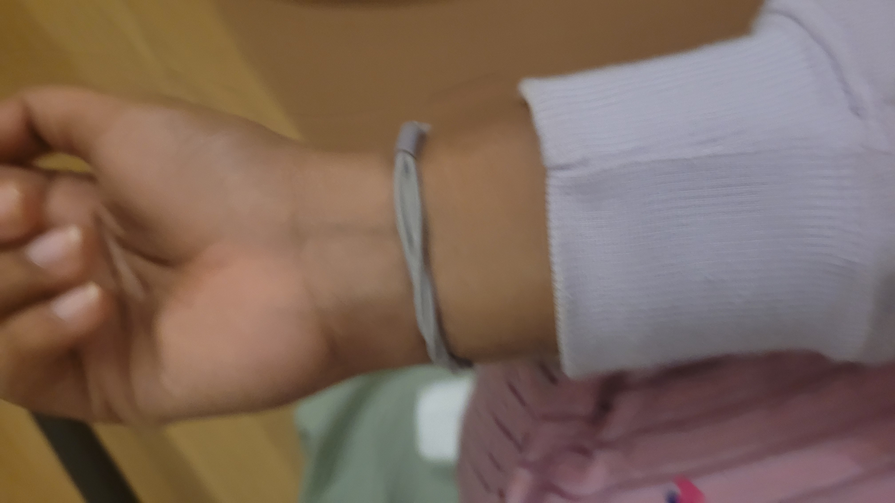

---
hide:
    - toc
---

# Living with your own ideas

Prosthesis:

What is a prosthesis?

**An extension of your body.**

Does it enable, enhance or help you explore yourself and your environment?

How much of a prosthesis is a need and how much of it is ormnamentation? Can jewellery be considered prosthesis? Can clothes be considered prosthesis?

How much is **form** and how much is **function**? Can a *social need* count as a function? Such as the need to impress, create identity and express yourself in the social ladder.

These were some of the questions that we were asking ourselves before the three day workshop.

Soon after, our conversations, readings and lectures with some hands-on-making gave us a whole different perspective on what a prosthesis could be. 

## Day 1: To be the best version of myself

**Proto 1**

For the first exercise, I started fitting objects at multiple parts of my body. I experimented with my ears, my knees, knuckles and elbows. I then went towards a quality of myself that I wanted to work on: clumsiness.

I built joint protectors for my knuckles and toes. 

Knuckle protector: To use when I am chopping vegetables in the kitchen.

Toes protector: To prevent myself from stubbing my toes all the time.

Proto 2

I also made a built in wrist band which held my T- mobilitat metro card to scan at the gates. I face a very hard time removing the card from my wallet and wallet from my bag every time I travel by the metro. I tested it to see if it saved time, and it worked like magic!

I was in and out of the gates in a few seconds!

| # | Front | Side  | Lateral |
| :--- | :--- | :--- |
|  { width="50%" }|  { width="50%" } |  { width="50%" } | 

# Reflections

**I, cyborg**

*Bodies: Cartoons and Cultural Deities*
I have grown up seeing daisies talk, octopuses help out, and butterflies cook. I have grown up seeing elephant gods being mischievous, monkey gods being loyal and parrot gods being intelligent. Seeing them never felt strange. It was easy to accept their identities, their actions and even feeling empathetic towards their personalities.” I wish I could be like Daisy.” “Oswald is too friendly, she should be a little less nice.” “Butterfly is so sweet. I wish I had a friend like her.”
Listening to mythological stories with non-human characters and watching animated versions on screen made me feel a part of their world. In a world with lesser political correctness and identity warfare, representation was not fought for. We had to accept cockroaches as annoying yappers. 

However, when the characters moved towards the “human” is when social biases started baking themselves into my understanding of the world. Transgender roles were often shown through a lens of violence. Women were shown through a lens of frailty and gay men were shown through a lens of shame. Let’s not forget the roles that were never even allowed close to the screen. 

Our fetishization of human identities in recent times has broadened representation and allowed human beings of various skin colours, sexual orientations, class politics and religious leanings to inhabit the media screen trying to erase our existing biases around what a socially accepted human looks like. But, what about enlarging our existing boundaries? 

What makes a human, and what is more-than-human? Is there a non-human?

The “Living with your Own Ideas” class centered on the design of social and functional prosthesis made me question myself within the blurry lines between bodies and identities in a search for the more-than-human. 

I was trained in classical dance from a very young age. Going back to my understanding of the world when I was younger, the dance form taught me to embody various animal gods who would appear in the mythological texts. A snake, a fish, a turtle, and my most favourite: the elephant. The god Ganesha, has a human body and a giant elephant head that is highly disproportionate to his body. He makes up for it with his slightly squatted posture, a round belly and by riding on his pet mouse. When embodying, I used to flap around his huge elephant like ears, show his tusk and posture my hands to account for his round belly, all while squatting. I was asked to feel like an elephant and walk like one. Using my own limited organs, I had tried to expand the possibility of being more-than-human through movement. 
When we were given our first brief on designing a prosthesis on being a better version of ourselves, I was stuck. I started playing with materials, and placing them on different parts of my body. I covered my elbow, my fingers and toes. I tried to make a “posture corrector”. A device for protection. The materials and requirements to be a better version informed my design decision. I created from a place of fear, and incompleteness. I wanted to be less clumsy and more careful. I forget that I could be more, rather than trying to make myself “just enough” or filling my faults. 

*Movement: Limitations of materiality in technology*

After a conversation with Manuel de Aguas, the intentions became clearer. Prosthesis could be a tool for exploration and not merely enhancement. As with Thomas Thwaites, I could choose to be a “goat.” Simply because I wanted to. 

If the objective was to be more than human, what were the tools? The physicality of embodying another life form meant expanding our bodily functions, having abilities that we would not possess otherwise. But, what about how they feel? How do bats echolocating and hunting for food at night react when they are lost? Do they panic or do they return home?

Thomas Thwaites spoke to a shaman before deciding to be a goat. He earlier wanted to become an elephant. She said it would not be too easy to embody an elephant, something that lives far from Thomas’ habitat. Also, elephants were highly emotionally intelligent animals. To embody them would mean impersonating their emotions, going into depressive episodes, mourn for the dead etc. Thomas wanted to take a break from being human. Elephants were too close to our human mental models. The shaman suggested he become something closer to him and easier to replicate. If we were to design exo-organs on a human to become a goat, we would have to reproduce the physical functions of one. In the process, Thomas built prosthesis for walking on four legs, a sac of rumen to digest grass and even a helmet to butt into other goats’ heads. He even spent 3 days in the mountains wandering with a herd of goats. They invited him into their herd and locked horns. After 3 days, tired and exhausted, Thomas was left behind by the herd purely because of the physical limitations. 

I asked Thomas a question at the end of his presentation. After all the work on the prosthetics, adorning them and playing around with how they worked, did it make you feel more human than a goat?

He said he was tired, exhausted and definitely wished he could sleep on a comfortable bed. I remembered my ways of embodying animals through movement and dance. Could a prosthesis limit our ability to transform to a replica of an existing organism? Could a prosthesis simply be a portal to exploring our own body to extents that it could never imagine itself in?

