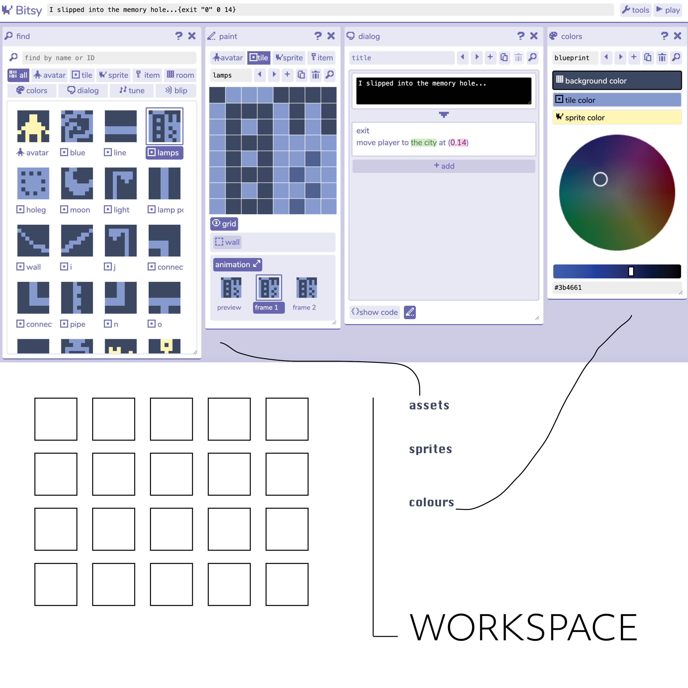
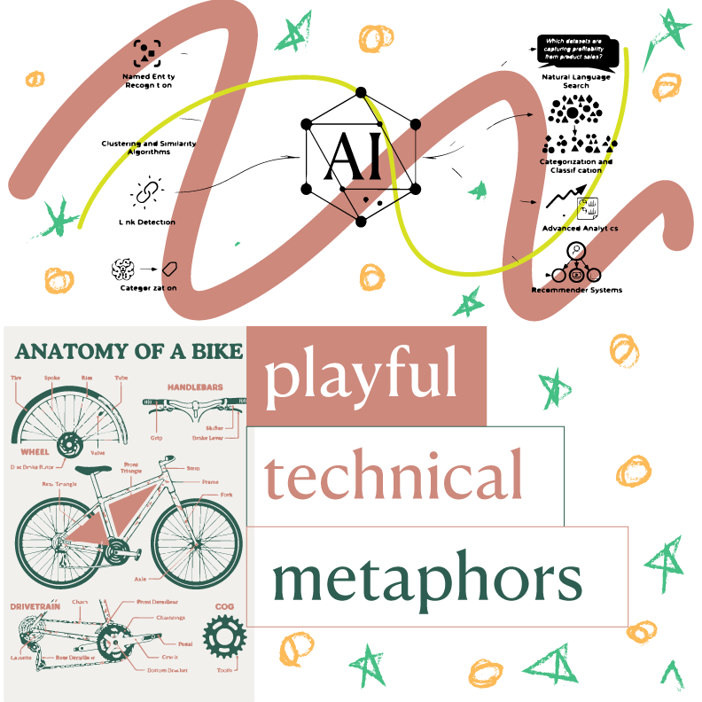

---
hide:
    - toc
---

# Publication Draft

For my inspiration of the publication I had intitally thought of a zine which showcases different frames of my game. A frame by frame animation of the game without words. As I started experimenting, I realised that I wanted my publication to look like the storyboard behind the animation; a behind the scenes of sorts. Taking inspiration from animation timelines and storybords with notes, arrow and scribbles, I designed the draft of my publication.

# Peer Review

I reviewed Hannah Peevy's work with AI and design that consisted of playfulness yet used metaphors to explain complex concepts.

