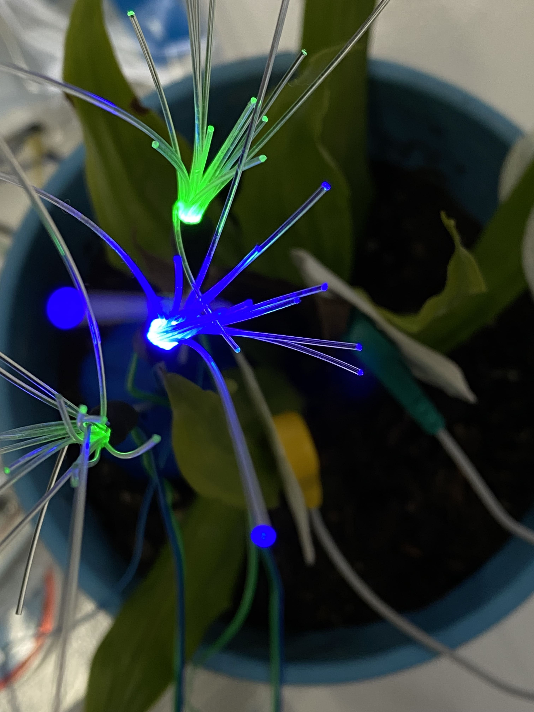

# Cognitive orgies 2

*What if you could whisper your secrets to a tree that promises to store it forever in the depths of it's heart in a language no one else understands? What if you could go back to hear it whisper it back to you again?*

**[Seeding Memories](https://www.hackster.io/swarnamanjaric/seeding-memories-0b3c5d)**

## Ethical Dilemma

Initially, we wanted to encode the memory in a tree. When we tried brainstorming techniques, we realised that any type of encoding would alter the physical state and use invasive techniques. We wanted to treat the plant with care. Thus we decided to evolve the project to observe signals and encrypt the data instead. 

## Technical challenges

We tried making the emg sensor read the data for almost 2 days. It's a tricky sensor to work with and needed extra power source. We also tried to make the amplifier work, but failed in the process. Thus, we switched to a headphone and microphone combination.

## Aesthetic goals

Only when we showed the prototype to the whole class and saw the reactions on everyone's faces was the aesthetic goal achieved. Some cried, some got emotional when they heard the tree whisper back their secrets in a buzzy ethereal hum. 