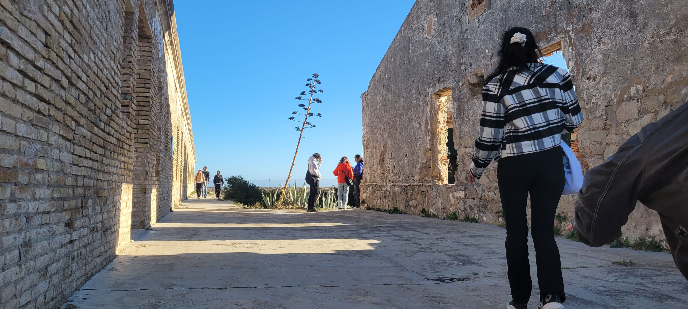

---
hide:
    - toc
---

# Situated Design practices

To situate or not situate, that is the question. I have always heard stories of supercomputers, even seen one from a distance before. During my first visit, I was unaware of the implications of computing at large scales. After doing reserach about the history of computation and information technology, I am able to see the physicality of these systems in new light. Quite literally. Visiting the BSC opened up my view of seeing the ginormous systems behind computing. Layered shelves of GPUs behind clear glass, flickering servers, power supplies and humongous water cooling pipes were transparent. Yet, the 9 tennis courts of infrastructure were still hidden. The chimneys evaporating water vapour, other cables and the operators maintaining the functioning of it. While the supercomputer held my attention only for the spatial dimension of it, the quantum computer put me in awe of its ethereality. Housed in a chapel, this machine landscape was otherworldly. It imposed on me various visual metaphors about technology and religion; a parallel comparison I had always been curious about.

The second day was a complete contrast to the previous environment. It was a space of negotiation between the industrial and the natural landscape. I biked with equal fervour through dirt tracks with wind brushing against my hair and the sunlight drifting through tall reeds that lined the side of the road. I held the sight of artichokes growing and hugged a kind guardian dog for the first time. We saw pottery that made music and aeroplanes that passed away with a rumble. It was a day of reconnecting with clay, the ground and food; listening to stories of the land of how it came to be across generations. From 220 farmers to 20 to a mere 8, the context of tourism, travel and trade getting importance over food was a sad story to hear. It was inspiring to see artists like Maria and Tom embracing the way of community and rural life while they pursued their interests. I realised that this Master's program - as much as is about technology, is pulling me back to my nostalgia of working with soil, the Earth and growing my own food. 

On the last day, I was engrossed in hearing from Hibai Arbide about his work with migration in the context of refugees. What fascinated me was the way he articulated complex issues and the way with which he handled language; he was very specific about phrasing definitions, and using words in their right context. "Pushbacks pave a path for illlegality." I noted down these specific terms that he used, that came out of deep intellectual rigour about the topic and not political correctness. It might be because he is a lawyer and a journalist, but as a designer it is something that I aspire to learn from and follow. 

