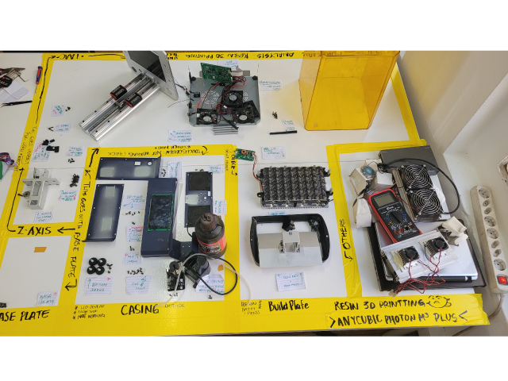
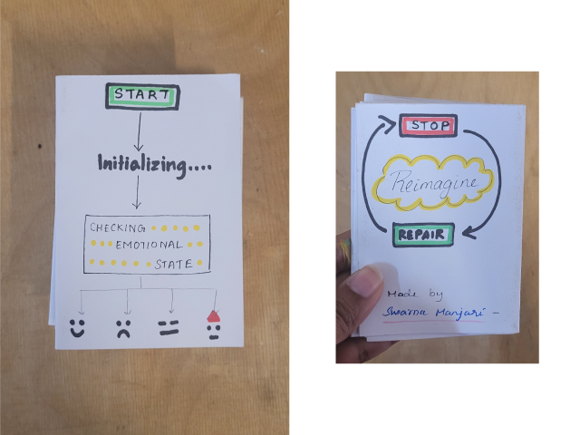
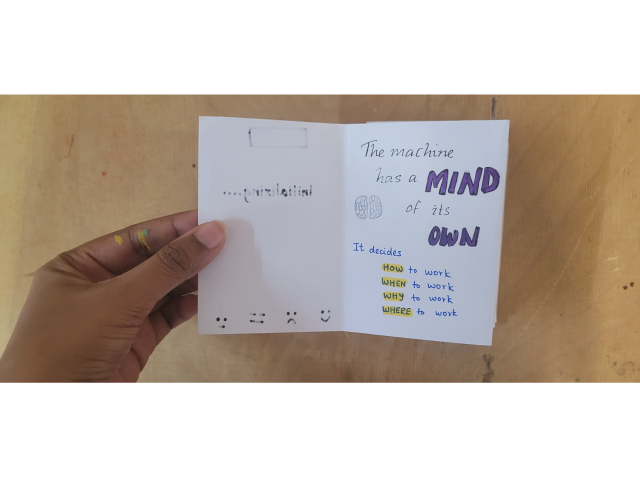
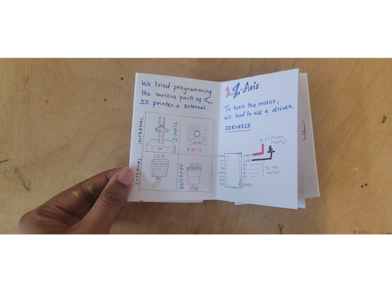
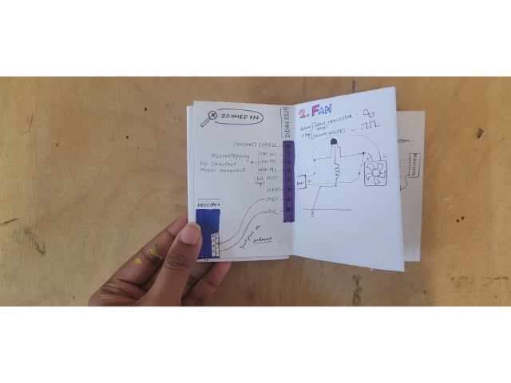
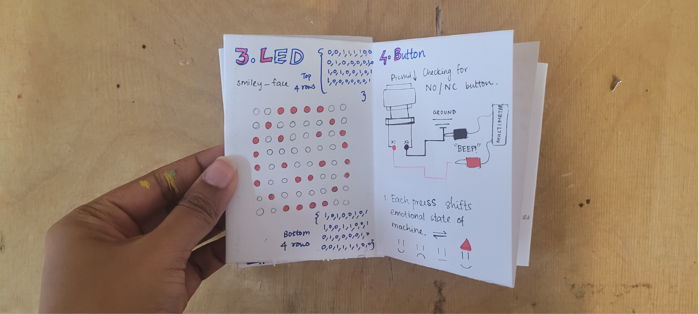
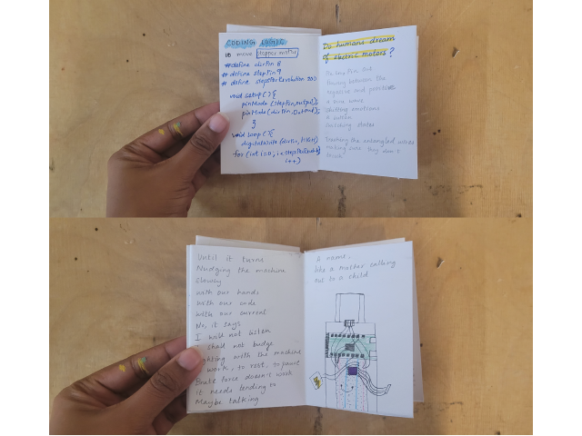

---
hide:
    - toc
---

# Unpacking Tech Systems

## We went from this 

## To this!

## How did we do it?
**[Peek into our process - The Forensic Report](https://hackmd.io/6bpTeFL1R0aKpRyyVLhDWw)**

# reflections

When we were first asked to unpack a machine by its parts, it never occurred to me that the parts could work on their own. I always envisioned a machine as its own entity, hiding how it functions, perhaps made to hide by the humans who designed it. Machines to me were black boxes concealing everything inside. Electricity was the magic that flowed through its veins, an idea that I grappled to understand. The switch was the command. When it didn’t turn on, something was off inside, and I never imagined that I could “fix” it. To me “unpacking machines” was an exercise that went beyond what could be repaired and what was beyond repair. It helped me understand that machines are complex systems that go beyond their materialities. They encompass geopolitics, trade, supply chains, extraction, logic and sometimes, even a bit of mechanical magic. The information that was held behind the functioning of each part from a mechanical pump to a motherboard to a small voltage booster that we completely ignored until we realised a light wouldn't turn on if you just connect the positive and negative to a power source, was extensive. I also realised that the presence and absence of the documentation of this information was vital to understanding how the machine functioned. Power lies behind how information is obscured by high level technical jargon when in reality the way things work follows a simple logic.

As we unpacked I couldn’t help observing the projection of our human biology to connect different parts of the machine. The wires flowed like arteries and veins, distributing electricity while a controller like an arduino was leading the nervous system like a central command centre.The individual parts all had specific functions but when it came together performed a completely different function than imagined. Similarly, the same list of parts could be made into different machines altogether. Through concepts, narratives, aspirations, and our specific worldviews, the same few parts could be connected in different ways to imagine a myriad of machines. Thus, fiction and imagination is as critical as logic and function when making a machine.  

## zine

# A zine about machines made by imagination

**[We made ..A Moody Elevator..](https://docs.google.com/presentation/d/11_xS_0ml6C-zfL2LV7qfNxleFGUzB8D4UYblDZbepPM/edit?usp=drive_link)**

**[watch the video here](https://drive.google.com/file/d/1nTU3J4Txr2c1WM4LEtSBieTEbGRmzlj4/view?usp=sharing)**

Thank you!! Cheers to simply Moody machines!

