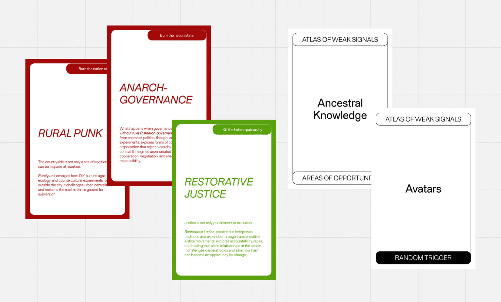
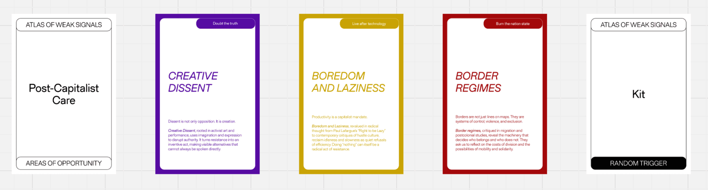
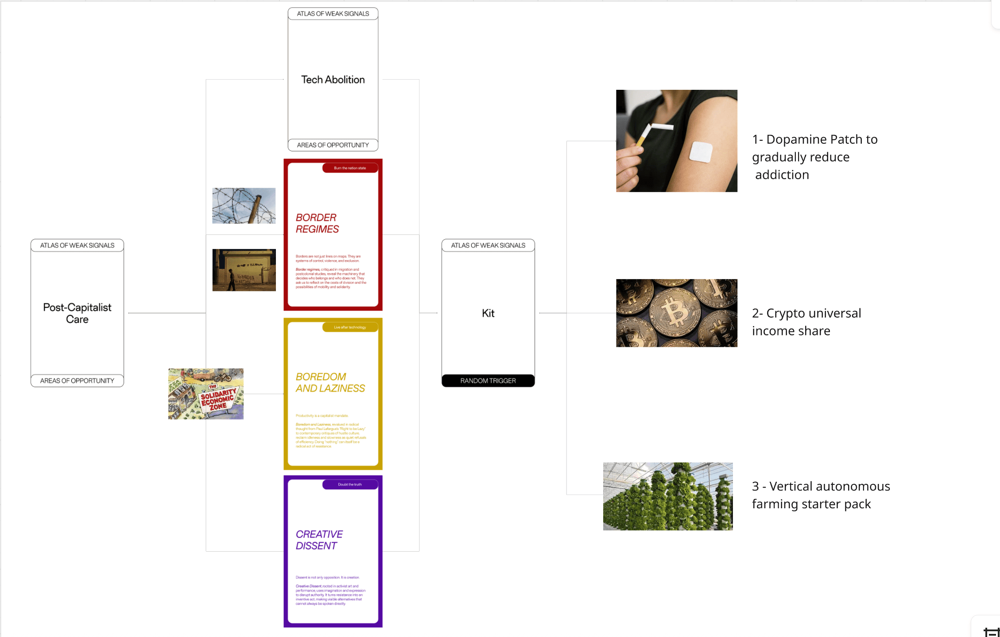

---
hide:
    - toc
---

# Atlas of Weak Signals

What I found fascinating about our first exercise with the atlas of weak signals, was the rootedness of the exercise. I have hunted sugnals for as far as I can remember, unconsciously. My blurting out of random trivia at dinner tables and conversations over coffee has earned me some weird stares and light hearted laughs. 

"Did you know that spinach could send emails?" my statement was answered with silence. 

Only here, was it observed with awe and surprise. Really? I would love to know more, said one of my classmates. Atop a cliff, overlooking the port of Barcelona, a heterotopia unto itself with moving goods. 

## Activity 

We were asked to pick a set of wecards, random triggers and areas of opportunity. From this, we had to devlop a scenario that would lead to a new weak signal. 

*Cards picked*

*New Card*

*New Scenario*

## Classroom game (9.12.25)

These cards give a nice ground for brainstorming novel concepts at the fringes, emerging from the weak signals of change. 

Working with the larger idea of post capitalist care, the sub topics of border regimes, boredom and laziness point to the overarching resistance that we find in the loops of capitalism. These simple non acts could be powerful actions in themselves. It is fighting the status quo of late stage capitalism through a unique kit. The kit is a helpful artefact that can be distributed amongst the masses. 

what is there in the Kit?

1 - Dopamine patches

2 - Cryptocurrency share

3 - Vertical farming kit

Through these three artefacts of rest and rebellion, we activated a post capitalist kit that brings back power to the masses. 

## Connecting weak signals to my research

